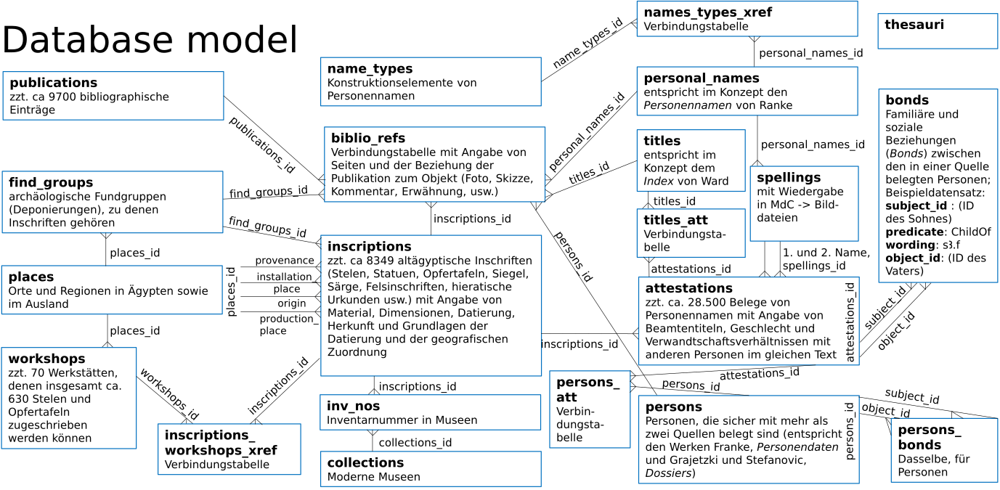

# Persons and Names of the Middle Kingdom  
Author: Alexander Ilin-Tomich (ailintom@uni-mainz.de)  
Johannes Gutenberg University Mainz  
Funded by the Fritz Thyssen Foundation as part of the project
[Umformung und Variabilität im Korpus altägyptischer Personennamen 2055-1550 v.Chr.](https://www.aegyptologie.uni-mainz.de/umformung-und-variabilitaet-1/)  
# Database structure
## Conventions  ,
Data are stored in a MySQL database. It is planned to export the data into an ontology-based machine-readable format (RDF); hence, equivalent classes and propertied in established ontologies are cited in this document.
For the sake of compatibility with other relational database management systems only the following datatypes are used:  
* `CHAR` (standard SQL data type `NATIONAL CHARACTER`) for short attributes;  
* `VARCHAR(255)` (standard SQL data type `NATIONAL CHARACTER VARYING (255)`) for fields with a fixed set of values;  
* `TEXT` (standard SQL data type `NATIONAL CHARACTER VARYING (4000)`) for longer text values (length restricted for compatibility with MS SQL Server);  
* `INT` (standard SQL data type `INTEGER`) for IDs;    
* `DATE` (standard SQL data type `DATE`) for dates.  
The collation `utf8mb4_unicode_ci` is used for all `CHAR` and `VARCHAR` fields.  Table and field names are set in lower case with words separated by underscores.

## ID numbers
The database uses a system of ID numbers that ensures that each ID uniquely identifies an entity within the whole database and thus contains information on the table where the record is stored.
 IDs are stored as signed 32-bit integers, which are used as bit fields, whereby the table is coded in bits 4 to 9, and bits 10 to 32 are used for the record number in the table, allowing for 8388607 records per table. Bits 1 to 3 are reserved. The table ID can be extracted from the record ID with two simple arithmetic operations `$table_id = (($id & 0x1F800000) >> 23);` in PHP 5 or in JavaScript or `CAST((id & 0x1F800000) >> 23 AS INT) AS table_id` in MySQL. The online web database supports references to ID numbers in any text field, coded as `@id` or `@id-any-human-readable-handle`, and renders them as links to the corresponding entities. Thus "established by @16782609, 64" or "established by @16782609-Franke-Heqaib, 64" should be rendered in HTML as `established by <a href='../publications/16782609'>Franke 1994</a>, 64`, and "datable after @33556813-Louvre-C249 (@226528715-PD-772)" should be rendered in HTML as `datable after <a href='../inscriptions/33556813'>Louvre C 239</a> (<a href='../persons/226528715'>PD 772</a> )`.

<!---
 
-->

## Tables

### thesauri *(table_id: 0)*  
This is a supporting table containing keys and values of self-developed and third-party thesauri used in the database.  

| Field name | Type | Description |
| --- | :---: | :--- |
| thesauri_id | INT | Unique record ID, primary key |
| date_created| DATE | Date when the record was created in the published version of the database |
| date_changed| DATE | Date when the last change to the record was published |
| thesaurus   | INT | The handle of the thesaurus to which this record belongs. Under `thesaurus=0` all thesauri represented in this table are listed with the keys to the `thesaurus` field stored in `sort_value`.  |
| parent      | INT | The `thesauri_id` of the superordinate thesaurus entry |
| sort_value  | INT | The value used for sorting entries within a thesaurus |
| item_name  | VARCHAR(191) | The textual value of the thesaurus entry |
| external_key| VARCHAR(255) | The key of the corresponding thesaurus entry in a standard external thesaurus (such as the [THOT](http://thot.philo.ulg.ac.be/index.html) project)  |
| explanation  | VARCHAR(4000) | The meaning of the thesaurus entry |
| sort_date_range_start | INT | The start of the date range for the entries in the dating thesaurus (thesaurus 5) (a negative integer value corresponding to a year BC, used for sorting purposes) |
| sort_date_range_end | INT | The end of the date range for the entries in the dating thesaurus (thesaurus 5) (a negative integer value corresponding to a year BC, used for sorting purposes) |

### criteria *(table_id: 14)*  
This is a supporting table containing criteria for establishing the date or the production place of inscribed objects.  

| Field name | Type | Description |
| --- | :---: | :--- |
| criteria_id | INT | Unique record ID, primary key |
| date_created| DATE | Date when the record was created in the published version of the database |
| date_changed| DATE | Date when the last change to the record was published |
| title   | VARCHAR(191) | The short title of the criterion used throughout the database.  |
| criterion           | TEXT | Short summary of the rule |
| production_place  | VARCHAR(191) | The `place_name` of the record in the table `places` corresponding to the place the criterion points to |
| dating            | VARCHAR(191) | The `item_name` of the period the criterion points to in the dating thesaurus (thesaurus 5), *loosely based on a subset of the [THOT Dates and dating systems thesaurus](http://thot.philo.ulg.ac.be/concept/thot-114)* |

*Note:* Bibliography is added through `biblio_refs`. The criteria are referred to in other records using the textual handles `@id-any-human-readable-handle` parsed by the online database.  

### publications *(table_id: 2)*  
Each record in this table describes a printed or online publication (a bibliographic entry). Here belongs everything published that can be cited using the author-year system.   
*Equivalent class: <http://www.cidoc-crm.org/cidoc-crm/E31_document>*  

| Field name | Type | Description | 
| --- | :---: | :--- |
| publications_id | INT | Unique record ID, primary key |
| date_created| DATE | Date when the record was created in the published version of the database |
| date_changed| DATE | Date when the last change to the record was published |
| csl_json | TEXT | Bibliographical data in the [CSL-JSON](https://resource.citationstyles.org/schema/latest/input/json/csl-data.json) format |
| author_year | VARCHAR(191) | The author-year handle for referring |
| author_year_sort | VARCHAR(191) | The author-year handle with the inverted order of the First and Last Name (for authors with coninciding surnames) |
| year | INT | Year of the publication for sorting purposes |
| html_entry | TEXT | Precomposed bibliographical entry in the Chicago Manual of Style format (HTML) |
| oeb_id | TEXT | The ID of the corresponding record in the [Online Egyptological Bibliography](http://oeb.griffith.ox.ac.uk/) (not available for all records) |
|digital_identifier | TEXT | URL or DOI of the publication |

*Note:* On the back end, CSL-JSON bibliographical descriptions are converted into HTML bibliographical entries using [citeproc-node](https://github.com/zotero/citeproc-node). When the data are converted to a machine-readable format, CSL-JSON entries can be converted to [BIBO, also known as Bibliontology](http://bibliographic-ontology.org/specification) RDF, using [Zotero translation server](https://github.com/zotero/translation-server).

### biblio_refs *(table_id: 7)*  
Each record in this table describes a reference from a publication (if the `source_id` field is not empty), a webpage (if the `source_url` field is not empty), or an offline source that cannot be cited using the author-date system to an entity (an inscribed object, a person's dossier, 
a workshop, an archaeological find group, a personal name, a title, or a criterion).   
*Equivalent property: <http://www.cidoc-crm.org/cidoc-crm/P70i_is_documented_in>*  

| Field name     | Type | Description |
| ---            | :---: | :--- |
| biblio_refs_id | INT | Unique record ID, primary key |
| date_created| DATE | Date when the record was created in the published version of the database |
| date_changed| DATE | Date when the last change to the record was published |
| reference_type | CHAR(20) | The type of the reference |
|order_value     | INT | Temporary field with the `reference_type` converted to a number for sorting purposes|
| source_id      | INT | The ID of the referring publication in the table `publications` |
| source_url     | TEXT | URL for online sources that cannot be cited using the author-year system |
| source_title   | TEXT | Reference to an offline source that cannot be cited using the author-year system (an archival document, an offline museum database, etc.; this also includes the references to the Topographical Bibliography to keep references to published and unpublished TopBib entries in one place) or the title of the online source referred to in `source_url` |
| accessed_on    | DATETIME | The date when the online or offline source that cannot be cited using the author-year system was accessed |
| object_id      | INT | The ID of the referred entity in any of the tables that can be referred to (`objects`, `inscriptions`, `find_groups`, `workshops`, `persons_att`, `persons`, `titles`, `personal_names`, `name_types`) |
| pages          | VARCHAR(191) | Pages, figures, plates, catalogue numbers, database ID where the entity is referred to in the source |
| pages_sort     | VARCHAR (191) | Natural sort value of `pages` |
| note           | TEXT | Note related to the reference (for example, mistakes in the publication) |

### objects *(table_id: 10)*  
Each record in this table represents a physical object with an Egyptian inscription. This can be an object now located in a museum or a private collection or known from a publication, archival document, or sale catalogue (such as a stela, statue, offering table, coffin, seal, papyrus, etc.), a rock inscription, an inscribed tomb, or another structure. Objects originally belonging to the same structure that has a different type than the objects themselves (e. g., stelae originally installed in the same offering chapel) are considered different objects, but objects that are parts of an originally integral object of the same type, now decomposed, (e. g., two parts of the same statue, now stored in different museums) are considered the same object. 

| Field name        | Type  | Description | Equivalent classes, properties |
| ---               | :---: | :---        | :--- |
| objects_id   | INT | Unique record ID, primary key | |
| date_created| DATE | Date when the record was created in the published version of the database |
| date_changed| DATE | Date when the last change to the record was published |
| title  | VARCHAR(191) | The title under which the object is referred to in the database (short museum name and main inventory number for objects in the museums or the reference to the most relevant (usually first) publication for other objects)  |
| title_sort |VARCHAR(191) | `Title` converted for natural sort|
| topbib_id | VARCHAR(255) | The reference to the Topographical Bibliography or a list of such references divided by semicolons |
| object_type  | VARCHAR(191) | The `item_name` of the inscription type in the object_type thesaurus (thesaurus 1); *example: stela*  |
| object_subtype | VARCHAR(191) | The `item_name` of the inscription subtype in the object_subtype thesaurus (thesaurus 2); *example: block-statue*  |
| material          | VARCHAR(191) | The `item_name` of the material type in the material  thesaurus (thesaurus 3), *based on a subset of the [THOT Material thesaurus](http://thot.philo.ulg.ac.be/concept/thot-6200)* |
| length            | INT | Preserved length of the object (for scarabs) in mm. | <http://www.cidoc-crm.org/cidoc-crm/P43_has_dimension>, <http://www.cidoc-crm.org/cidoc-crm/E54_Dimension> |
| height            | INT | Preserved height of the object in mm. | <http://www.cidoc-crm.org/cidoc-crm/P43_has_dimension>, <http://www.cidoc-crm.org/cidoc-crm/E54_Dimension> |
| width             | INT | Preserved width of the object in mm. | <http://www.cidoc-crm.org/cidoc-crm/P43_has_dimension>, <http://www.cidoc-crm.org/cidoc-crm/E54_Dimension> |
| thickness         | INT | Preserved thickness of the object in mm. | <http://www.cidoc-crm.org/cidoc-crm/P43_has_dimension>, <http://www.cidoc-crm.org/cidoc-crm/E54_Dimension> | 
| find_groups_id    | INT | The ID of the archaeological find_group to which the inscribed object belongs in the table `find_groups` |
| provenance        | VARCHAR(191) | The `place_name` of the record in the table `places` corresponding to the place where the object was found or purchased | <http://lawd.info/ontology/foundAt> |
| provenance_sort| INT | The `latitude` of the record in the table `places` corresponding to the `provenance` |
| provenance_note   | TEXT | Note related to the `provenance` |
| installation_place| VARCHAR(191) | The `place_name` of the record in the table `places` corresponding to the place where the object should have been installed (when different from the provenance or when the provenance is unknown or unreliable, as in case of purchases) |
| installation_place_sort| INT | The `latitude` of the record in the table `places` corresponding to the `installation_place` |
| installation_place_note   | TEXT | Note related to the `installation_place` |
| production_place  | VARCHAR(191) | The `place_name` of the record in the table `places` corresponding to the place where the object should have been produced | <http://lawd.info/ontology/origin> |
| production_place_sort| INT | The `latitude` of the record in the table `places` corresponding to the `production_place` |
| production_place_note | TEXT | The reasoning behind the `production_place` with relevant bibliographical references whenever possible |

### objects_inscriptions_xref *(table_id: 12)*  
Each record in this table represents a link between an inscribed object and an inscription it carries. Several inscribed objects may carry one an the same inscription as in the case of multiple impressions of the same seal or multiple funerary cones with identical. On the other side one and the same object can carry several inscriptions created in different periods.  

| Field name        | Type  | Description | Equivalent classes, properties |
| ---               | :---: | :---        | :--- |
| objects_inscriptions_xref_id   | INT | Unique record ID, primary key | |
| date_created| DATE | Date when the record was created in the published version of the database |
| date_changed| DATE | Date when the last change to the record was published |
| objects_id   | INT   | ID of the inscribed object, which carries an inscription | subject of <http://www.cidoc-crm.org/cidoc-crm/P128_carries> |
| inscriptions_id   | INT   | ID of the inscription, which is carried by an object | objects of <http://www.cidoc-crm.org/cidoc-crm/P128_carries> |

### inscriptions *(table_id: 4)*  
Each record in this table represents an Egyptian inscription attested on one or several physical objects. Texts inscribed on the same object on different occasions are separate inscriptions.  

| Field name        | Type  | Description | Equivalent classes, properties |
| ---               | :---: | :---        | :--- |
| inscriptions_id   | INT | Unique record ID, primary key | |
| date_created| DATE | Date when the record was created in the published version of the database |
| date_changed| DATE | Date when the last change to the record was published |
| title  | VARCHAR(191) | The title under which the inscription is referred to in the database. Usually the same as the object's title.  |
| title_sort |VARCHAR(191) | `Title` converted for natural sort|
| tmtexts_id | INT | The reference to the text in the [Trismegistos Texts](https://www.trismegistos.org/tm/) database |
| tla | INT | The reference to the text in the [Thesaurus Linguae Aegyptiae](http://aaew.bbaw.de/tla/servlet/TlaLogin) database |
| text_content      | VARCHAR(191) | The `item_name` of the text content type in the text_content thesaurus (thesaurus 4), *based on a subset of the [THOT Text content thesaurus](http://thot.philo.ulg.ac.be/concept/thot-18634)* |
| script            | VARCHAR(191) | The `item_name` of the script in the script thesaurus (thesaurus 12), *based on a subset of the [THOT Ancient Egyptian scripts thesaurus](http://thot.philo.ulg.ac.be/concept/thot-111)* |
| origin            | VARCHAR(191) | The `place_name` of the record in the table `places` corresponding to the place where the person(s) named in the inscription should have lived |
| origin_sort| INT | The `latitude` of the record in the table `places` corresponding to the `origin` |
| origin_note       | TEXT | The reasoning behind the `origin` with relevant bibliographical references whenever possible |
| inst_prov_temp | VARCHAR(191) | Equals the object's `installation_place` if defined; otherwise, `provenance` |
| inst_prov_temp_sort | INT | Equals the object's `installation_place_sort` if defined; otherwise, `provenance_sort` |
| orig_prod_temp | VARCHAR(191) | Equals `origin` if defined; otherwise, the object's `production_place` |
| orig_prod_temp_sort | INT | Equals `origin_sort` if defined; otherwise, the object's `production_place_sort` |
| region_temp | VARCHAR(191) | Equals `orig_prod_temp` if defined; otherwise, `inst_prov_temp` |
| region_temp_sort | INT | Equals `orig_prod_temp_sort` if defined; otherwise, `inst_prov_temp_sort` |
| dating            | VARCHAR(191) | The `item_name` of the period to which the inscription can be dated in the dating thesaurus (thesaurus 5), *loosely based on a subset of the [THOT Dates and dating systems thesaurus](http://thot.philo.ulg.ac.be/concept/thot-114)* |
| dating_sort_start | INT | The `sort_date_range_start` of the period to which the inscription can be dated in the dating thesaurus |
| dating_sort_end | INT | The `sort_date_range_end` of the period to which the inscription can be dated in the dating thesaurus |
| dating_note       | TEXT | The reasoning behind the `dating`  |
| last_king_id      | INT | The `thesauri_id`  of the most recent king explicitly named in the inscription in the king thesaurus (thesaurus 6), *loosely based on a subset of the [THOT Dates and dating systems thesaurus](http://thot.philo.ulg.ac.be/concept/thot-114)* |
| note              | TEXT | General notes related to the inscription |

### find_groups *(table_id: 23)*  
Each record in this table represents an archaeological find group (such as a burial or a memorial chapel) where one or more inscribed objects were found. These data are supplementary and are entered only to the extent that it can be relevant for dating and grouping together inscribed objects.  

| Field name        | Type  | Description |
| ---               | :---: | :---        |
| find_groups_id    | INT   | Unique record ID, primary key |
| date_created| DATE | Date when the record was created in the published version of the database |
| date_changed| DATE | Date when the last change to the record was published |
| site              | VARCHAR(191) | The `place_name` of the record in the table `places` corresponding to the place where the find group is located |
| site_area         | VARCHAR(255) | The part of the site where the find group is located |
| exact_location    | TEXT| A detailed description of the find group location |
| title             | VARCHAR(191) | The title under which the find group is referred to in the database |
| title_sort             | VARCHAR(191) | `title` converted for natural sort |
| find_group_type   | VARCHAR(191) | The `item_name` of the find group type in the find_group_type thesaurus (thesaurus 7)  |
| architecture      | TEXT| Relevant information on the substructure and the superstructure |
| human_remains     | TEXT| Relevant information on the deceased in the find group |
| finds             | TEXT| Relevant information on the finds other than inscribed objects |
| disturbance       | VARCHAR(191) | The `item_name` of the find group type in the disturbance thesaurus (thesaurus 8)  |
| dating            | VARCHAR(191) | The `item_name` of the period to which the find group can be dated in the dating thesaurus (thesaurus 5), *loosely based on a subset of the [THOT Dates and dating systems thesaurus](http://thot.philo.ulg.ac.be/concept/thot-114)* |
| dating_note       | TEXT | The reasoning behind the `dating`  |
| note              | TEXT | General notes related to the find group |

### workshops *(table_id: 20)*  
Each record in this table represents a workshop producing inscribed objects that was discussed in scholarly literature. In other words, it represents a group of objects set off by several artistic and/or palaeographic peculiarities, which allow surmising that the objects were produced at the same place and within the same period.  

| Field name        | Type  | Description |
| ---               | :---: | :---        |
| workshops_id      | INT   | Unique record ID, primary key |
| date_created| DATE | Date when the record was created in the published version of the database |
| date_changed| DATE | Date when the last change to the record was published |
| title             | VARCHAR(191) | The title under which the workshop is referred to in the database |
| title_sort       | VARCHAR(191) | `title` converted for natural sort |
| production_place  | VARCHAR(191) | The `place_name` of the record in the table `places` corresponding to the place where the objects should have been produced |
| production_place_sort| INT | The `latitude` of the record in the table `places` corresponding to the `production_place` |
| production_place_note | TEXT | The reasoning behind the `production_place` with relevant bibliographical references whenever possible |
| dating            | VARCHAR(191) | The `item_name` of the period to which the workshop can be dated in the dating thesaurus (thesaurus 5), *loosely based on a subset of the [THOT Dates and dating systems thesaurus](http://thot.philo.ulg.ac.be/concept/thot-114)* |
| dating_sort_start | INT | The `sort_date_range_start` of the period to which the workshop can be dated in the dating thesaurus |
| dating_sort_end | INT | The `sort_date_range_end` of the period to which the workshop can be dated in the dating thesaurus |
| dating_note       | TEXT | The reasoning behind the `dating`  |
| note              | TEXT | General notes related to the workshop |

### inscriptions_workshops_xref *(table_id: 21)*  
An associative table for linking workshops to objects (assuming that contradictory opinions can be expressed in scholarly literature). 

| Field name        | Type  | Description |
| ---               | :---: | :---        |
| inscriptions_workshops_xref_id | INT   | Unique record ID, primary key |
| date_created| DATE | Date when the record was created in the published version of the database |
| date_changed| DATE | Date when the last change to the record was published |
| workshops_id                   | INT   | ID of the workshop |
| objects_id                | INT   | ID of the inscribed object |
| status            | CHAR(8)   | Status of the link ("accepted", "weak", or "rejected")  |
| note        | TEXT | Note concerning the appurtenance of the inscribed object to the workshop |

### places *(table_id: 22)*  
Each record in this table represents the name of a place or a region associated with inscriptions catalogued in this database. One location can be listed in this table several times under different names (modern and ancient).  
*Equivalent class: <http://lawd.info/ontology/PlaceName>*  

| Field name        | Type  | Description |
| ---               | :---: | :---        |
| places_id         | INT   | Unique record ID, primary key |
| date_created| DATE | Date when the record was created in the published version of the database |
| date_changed| DATE | Date when the last change to the record was published |
| place_name        | VARCHAR(191) | The short form of the name used in this database |
| long_place_name  | VARCHAR(255) | The expanded form of the name used in this database |
| relative_location | VARCHAR(191) | The `item_name` in the relative_location thesaurus (thesaurus 9), either "Eastern Desert", "Nile Valley", "Western Desert", or the "Levant" |
| macro_region | VARCHAR(191) | The `place_name` in the `places` table corresponding to the larger region this place is a part of |
| latitude          | INT   | The latitude of the place (or of the central point of the region) in decimal degrees north of equator multiplied by 100. Thus 2572 stands for 25.72 N or 25° 43' N. This value is used for sorting the places in a north to south or south to north order.  |
| topbib_id         | VARCHAR(255) | The ID of the place name in the [Digital TopBib](http://topbib.griffith.ox.ac.uk) database; *examples: [501-180](http://topbib.griffith.ox.ac.uk//dtb.html?topbib=501-180) or [901-210-003](http://topbib.griffith.ox.ac.uk//dtb.html?topbib=901-210-003)* |
| tm_geoid          | INT   | The ID of the place in the Trismegistos Geo database; *example: [188](http://www.trismegistos.org/place/188)* |
| pleiades_id       | INT   | The ID of the place in [Pleiades](https://pleiades.stoa.org); *example: [688038](https://pleiades.stoa.org/places/688038)* |
| artefacts_url     | VARCHAR(255) | The URL of the site page in the [Artefacts of Excavation](http://egyptartefacts.griffith.ox.ac.uk) database; *example: <http://egyptartefacts.griffith.ox.ac.uk/node/1149>* |
| inscriptions_count_temp | INT   | Temporary field to store the number of associated inscriptions for display in the web interface |

### inv_nos *(table_id: 25)*  
Each record in this table represents an inventory number of an inscribed object in a museum or other modern collection.  
*Equivalents: <http://www.cidoc-crm.org/cidoc-crm/P1_is_identified_by> property and <http://www.cidoc-crm.org/cidoc-crm/E42_Identifier> class*   

| Field name        | Type  | Description |  Equivalent classes, properties |
| ---               | :---: | :---        | :---        |
| inv_nos_id        | INT   | Unique record ID, primary key |
| date_created| DATE | Date when the record was created in the published version of the database |
| date_changed| DATE | Date when the last change to the record was published |
| objects_id   | INT   | ID of the inscribed object identified by the inventory number |
| collections_id    | INT   | ID of the museum |
| inv_no            | VARCHAR(255) | Inventory number | <http://www.w3.org/2000/01/rdf-schema#label> |
| inv_no_sort             | VARCHAR(191) | `inv_no` converted for natural sort |
| status            | CHAR(11) | Status of the inventory number ("main", "alternative", "obsolete", or "erroneous"). The only case when an object can have more than one main inventory numbers is when its pieces bear separate inventory numbers |
| note              | TEXT| General notes related to the inventory number |

### collections  *(table_id: 26)*  
Each record in this table represents a modern collection containing inscribed objects identified by inventory numbers.  
  

| Field name        | Type  | Description |
| ---               | :---: | :---        |
| collections_id    | INT   | Unique record ID, primary key |
| date_created| DATE | Date when the record was created in the published version of the database |
| date_changed| DATE | Date when the last change to the record was published |
| full_name_en         | TEXT | Official full name of the collection (in English) |
| full_name_national_language         | TEXT | Official full name of the collection (in the main regional or national language) |
| title             | VARCHAR(191) | Short title used in the database |
| location          | VARCHAR(255) | Locality and country |
| url               | TEXT| Official website of the collection (main page) |
| online_collection | TEXT| URL of the online collection |
| tm_coll_id        | INT    | [Trismegistos Collections](http://www.trismegistos.org/coll/index.php) ID  |
| thot_concept_id   | TEXT    | URI of the collection in the [THOT Museums and private collections thesaurus](http://thot.philo.ulg.ac.be/concept/thot-6197) |
| artefacts_url | TEXT| URL of the collection page in the [Artefacts of Excavation](http://egyptartefacts.griffith.ox.ac.uk) database |

  
### attestations *(table_id: 8)*  
Each record in this table represents an attestation of a person, of one or two personal names, and of a string of titles (if any) born by that person in an inscription.  
*Equivalent classes: <http://lawd.info/ontology/NameAttestation>, <http://lawd.info/ontology/PersonAttestation>*  

| Field name        | Type  | Description | Equivalent classes, properties |
| ---               | :---: | :---        | :---        |
| attestations_id   | INT   | Unique record ID, primary key |
| date_created| DATE | Date when the record was created in the published version of the database |
| date_changed| DATE | Date when the last change to the record was published |
| inscriptions_id   | INT   | ID of the inscription | <http://lawd.info/ontology/hasCitation> + <http://lawd.info/ontology/represents> |
| gender               | CHAR(1)        | Gender of the attested person ("m", "f", "?" *gender unknown*, or "a" *for animals*)|
| title_string      | TEXT| Transliterated title string in lowercase Unicode as preserved in the inscription, separated by semicolons |
| title_string_sort | TEXT | Generated sort value for sorting in the `title_string` column |
| title_string_search | TEXT | Generated sort value for searching in the `title_string` column  |
| personal_name     | VARCHAR(191)   | Transliterated personal name or combination of names in lowercase Unicode as preserved in the inscription, double names separated by / |
| personal_name_sort | VARCHAR(191) | Generated sort value for sorting in the `personal_name` column |
| personal_name_search | VARCHAR(191) | Generated sort value for searching in the `personal_name` column |
| status            | CHAR(6)        | Status of the person on the monument ("owner" or "patron" or "")|
| location          | VARCHAR(191)        | The place in the inscription where the person is mentioned (register, line number according to the standard publication or other relevant indications)| Data stored in the <http://lawd.info/ontology/Citation> class |
| epithet | VARCHAR(191) | An epithet (Beiwort) characterizing the age or the gender of the person, which stands after the name |
| representation | VARCHAR(191) | Whether the person is represented by a human figure |
| note              | TEXT| General notes related to the attestation |

### spellings_attestations_xref *(table_id: 15)*  
Each record in this table represents a link between an attestation of a person and a spelling. When a person bears a double name in a particular source, two records are created in `spellings_attestations_xref`, one for the first name and one for the second name. When a person is attested on the same monuments with the same name in two different spellings, two records are created in  `spellings_attestations_xref`, one for the first name, and one for the second name. 
Roughly corresponds to tokens in [iClassifier](https://www.iclassifier.pw).

| Field name        | Type  | Description | Equivalent classes, properties |
| ---               | :---: | :---        | :---        |
| spellings_attestations_xref_id   | INT   | Unique record ID, primary key |
| date_created| DATE | Date when the record was created in the published version of the database |
| date_changed| DATE | Date when the last change to the record was published |
| attestations_id   | INT   | ID of the attestation |
| spellings_id      | INT   | ID of the spelling |
| classifier | VARCHAR(191) | Gardiner codes of classifier(s) standing after the given spelling in the inscription |
| epithet_mdc | VARCHAR(191) | An epithet (Beiwort) characterizing the age or the gender of the person, which stands after the name, in JSesh-compatible MdC codes |

### persons_attestations_xref *(table_id: 1)*  
Each record in this table represents a statement on the appurtenance of an attestation to a dossier.  
Equvalent property: <http://lawd.info/ontology/hasAttestation>

| Field name        | Type  | Description |
| ---               | :---: | :---        |
| persons_attestations_xref_id    | INT   | Unique record ID, primary key |
| date_created| DATE | Date when the record was created in the published version of the database |
| date_changed| DATE | Date when the last change to the record was published |
| attestations_id   | INT   | ID of the attestation  |
| persons_id        | INT   | ID of the person's dossier  |
| reasoning         | VARCHAR(191)   | Reasons for accepting or rejecting the attestation as a part of a dossier. Iteally. a list of `item_name` values in the dossier_reasoning thesaurus (thesaurus 10) separated by semicolons (not yet implemented); *example: "same name; related title; same mother's name"* |
| status            | CHAR(8)   | Status of the statement ("accepted", "weak", or "rejected")  |
| note              | TEXT| General notes related to the statement |

### persons *(table_id: 27)*  
Each record in this table represents a dossier of a person attested in more than one inscription.  
*Equivalent: entries in* D. Franke, *Personendaten aus dem Mittleren Reich (20.-16. Jahrhundert v. Chr.)*   
*Equivalent class: <http://lawd.info/ontology/Person>*   

| Field name        | Type  | Description |
| ---               | :---: | :---        |
| persons_id        | INT   | Unique record ID, primary key |
| date_created| DATE | Date when the record was created in the published version of the database |
| date_changed| DATE | Date when the last change to the record was published |
| gender               | CHAR(1)        | Gender of the person ("m", "f", "?" *gender unknown*, or "a" *for animals*)|
| title             | VARCHAR(255)   | The designation of the dossier referred to in the database such as the reference to the work where the dossier was first established; *example: "PD 599"* |
| title_sort       | VARCHAR(191) | `title` converted for natural sort |
| title_string      | TEXT| Transliterated title string in lowercase Unicode as reconstructed from all available attestations, separated by semicolons |
| title_string_sort | TEXT | Generated sort value for sorting in the `title_string` column |
| title_string_search | TEXT | Generated sort value for searching in the `title_string` column  |
| personal_name     | VARCHAR(255)   | Transliterated personal name or combination of names in lowercase Unicode as reconstructed from all available attestations, double names separated by / |
| personal_name_sort | VARCHAR(191) | Generated sort value for sorting in the `personal_name` column |
| personal_name_search | VARCHAR(191) | Generated sort value for searching in the `personal_name` column |
| note              | TEXT| General notes related to the person |
| dating            | VARCHAR(191) | The `item_name` of the period to which the person can be dated in the dating thesaurus (thesaurus 5), *loosely based on a subset of the [THOT Dates and dating systems thesaurus](http://thot.philo.ulg.ac.be/concept/thot-114)* |
| dating_sort_start | INT | The `sort_date_range_start` of the period to which the person can be dated in the dating thesaurus |
| dating_sort_end | INT | The `sort_date_range_end` of the period to which the person can be dated in the dating thesaurus |
| dating_note       | TEXT | The reasoning behind the `dating`  |
| region            | VARCHAR(191) | The `place_name` of the record in the table `places` corresponding to the person's suggested main place of activity |
| region_sort| INT | The `latitude` of the record in the table `places` corresponding to the `region` |
| region_note       | TEXT | The reasoning behind the `region`  |

### titles_att *(table_id: 28)*  
Each record in this table represents an attestation of a title in a string of titles in an inscription.  

| Field name        | Type  | Description |
| ---               | :---: | :---        |
|titles_att_id      | INT   | Unique record ID, primary key |
| date_created| DATE | Date when the record was created in the published version of the database |
| date_changed| DATE | Date when the last change to the record was published |
|titles_id          | INT   | ID of the attested title |
|attestations_id    | INT   | ID of the attestation of a person bearing a title |
|sequence_number    | INT   | Sequence number of the title in the title string |
|spelling    | VARCHAR(255)   | Optional: the spelling of the title in JSesh-compatible MdC codes |

### titles *(table_id: 5)*  
Each record in this table represents an Egyptian title.  
*Equivalent: entries in* W. A. Ward, *Index of Egyptian Administrative and Religious Titles of the Middle Kingdom*

| Field name        | Type  | Description |
| ---               | :---: | :---        |
|      titles_id    | INT   | Unique record ID, primary key |
| date_created| DATE | Date when the record was created in the published version of the database |
| date_changed| DATE | Date when the last change to the record was published |
| title             | VARCHAR(191)   | Transliterated title in lowercase unicode |
| title_sort | TEXT | Generated sort value for sorting in the `title` column |
| title_search | TEXT | Generated sort value for searching in the `title` column |
| translation_en    | VARCHAR(191)   | English translation of the title |
| translation_de    | VARCHAR(191)   | German translation of the title |
|gender                | CHAR(4)        | Gender of persons bearing the title ("m", "f", or "both")|
| tla | VARCHAR(255)   | List of corresponding lemma numbers in the [Thesaurus Linguae Aegyptiae](http://aaew.bbaw.de/tla/servlet/TlaLogin), separated by semicolons |
| hannig | VARCHAR(191)   | List of corresponding lemma numbers in R. Hannig, *Ägyptisches Wörterbuch II: Mittleres Reich und Zweite Zwischenzeit*, separated by semicolons |
| hannig_sort | VARCHAR(191)   | Temporary field with the `hannig` number converted for natural sort |
| ward_fischer | VARCHAR(191)   | List of corresponding lemma numbers in Ward, Index of Egyptian Administrative and Religious Titles of the Middle Kingdom and Fischer, Egyptian Titles of the Middle Kingdom. A Supplement to Wm. Ward's Index |
| ward_fischer_sort | VARCHAR(191)   |  Temporary field with the `ward_fischer` number converted for natural sort |
| taylor | VARCHAR(191)   | List of corresponding lemma numbers in Taylor, An Index of Male Non-Royal Egyptian Titles, Epithets and Phrases of the 18th Dynasty |
| taylor_sort | VARCHAR(191)   |  Temporary field with the `taylor` number converted for natural sort |
| ayedi | VARCHAR(191)   | List of corresponding lemma numbers in al-Ayedi, Index of Egyptian administrative, religious and military titles of the New Kingdom |
| ayedi_sort | VARCHAR(191)   |  Temporary field with the `ayedi` number converted for natural sort |
|usage_area         | VARCHAR(191)   | The `place_name` of the record in the table `places` corresponding to the region where the title was predominantly used |
|usage_area_sort |    INT | The `latitude` of the record in the table `places` corresponding to the `usage_area` |
|usage_area_note    | TEXT  | Explanatory notes and bibliographic references to the `usage_area` |
|usage_period       | VARCHAR(191)   | The `item_name` of the period when the title was predominantly used in the dating thesaurus (thesaurus 5), *loosely based on a subset of the [THOT Dates and dating systems thesaurus](http://thot.philo.ulg.ac.be/concept/thot-114)*   |
|usage_period_sort |    INT | The sort value of the period to which the title can be dated  |
|usage_period_note    | TEXT  | Explanatory notes and bibliographic references to the `usage_period` |
| note              | TEXT| General notes related to the title |

*Note:* The numbers of the title in W. A. Ward, *Index of Egyptian Administrative and Religious Titles* and H. G. Fischer, *Supplement* are entered using `biblio_refs`

### spellings *(table_id: 29)*  
Each record in this table represents a spelling type of a personal name. Generic entries with empty spellings are used for names attested in sources accessible only in transliteration or translation.   

| Field name        | Type  | Description |
| ---               | :---: | :---        |
| spellings_id      | INT   | Unique record ID, primary key |
| date_created| DATE | Date when the record was created in the published version of the database |
| date_changed| DATE | Date when the last change to the record was published |
| personal_names_id | INT   | ID of the personal name corresponding to the preferred reading of the spelling |
| spelling          | VARCHAR(191)   | The spelling of the name in in JSesh-compatible MdC codes |
| spelling_norm | VARCHAR(191)   | Normalized spelling |
| ranke             | VARCHAR(255)   | The corresponding entry in Ranke, *Personennamen* |
|usage_area         | VARCHAR(255)   | The `place_name` of the record in the table `places` corresponding to the region where the spelling was predominantly used |
|usage_area_note    | TEXT  | Explanatory notes and bibliographic references to the `usage_area` |
|usage_period       | VARCHAR(255)   | The `item_name` of the period when the spelling was predominantly used in the dating thesaurus (thesaurus 5), *loosely based on a subset of the [THOT Dates and dating systems thesaurus](http://thot.philo.ulg.ac.be/concept/thot-114)*   |
|usage_period_note    | TEXT  | Explanatory notes and bibliographic references to the `usage_period` |

*Note:* On the back end, a script uses [JSesh](http://jsesh.qenherkhopeshef.org/) to generate PNG graphical files corresponding to MdC codes. These graphical files get names according to `spellings_id` and appear in the online database. 

### alternative_readings *(table_id: 9)*  
Each record in this table represents a possible reading of a spelling, differing from the preferred reading specified in the `personal_names_id`   

| Field name        | Type  | Description |
| ---               | :---: | :---        |
| alternative_readings_id      | INT   | Unique record ID, primary key |
| date_created| DATE | Date when the record was created in the published version of the database |
| date_changed| DATE | Date when the last change to the record was published |
| spellings_id      | INT   | ID of the spelling |
| personal_names_id | INT   | ID of the personal name corresponding to the alternate reading of the spelling |

### personal_names *(table_id: 17)*  
Each record in this table represents an Egyptian name.  
*Equivalent: entries in* H. Ranke, *Die ägyptischen Personennamen*  
*Equivalent class: <http://lawd.info/ontology/PersonalName>*  

| Field name        | Type  | Description | Equivalent classes, properties |
| ---               | :---: | :---        | :---        |
|personal_names_id  | INT   | Unique record ID, primary key |
| date_created| DATE | Date when the record was created in the published version of the database |
| date_changed| DATE | Date when the last change to the record was published |
|personal_name      | VARCHAR(191)   | Transliterated personal name in lowercase Unicode | <http://lawd.info/ontology/primaryForm> |
| personal_name_sort | VARCHAR(191) | Generated sort value for sorting in the `personal_name` column |
| personal_name_search | VARCHAR(191) | Generated sort value for searching in the `personal_name` column |
|translation_en     | VARCHAR(255)   | English translation of the name |
|translation_de     | VARCHAR(255)   | German translation of the name |
|gender                | CHAR(4)        | Gender of persons bearing the name ("m", "f", "both", or "a" *for animals*)|
|ranke              | VARCHAR(191)   | List of corresponding entries in Ranke, *Personennamen*, separated by semicolons |
|ranke_sort              | VARCHAR(191)   | `ranke` converted for natural sort |
|tla                | VARCHAR(191)   | List of corresponding lemma numbers in the [Thesaurus Linguae Aegyptiae](http://aaew.bbaw.de/tla/servlet/TlaLogin), separated by semicolons |
|scheele-schweitzer | VARCHAR(191)   | List of corresponding entries in K. Scheele-Schweitzer, *Die Personennamen des Alten Reiches*, separated by semicolons |
|agea               | VARCHAR(191)   | List of corresponding name numbers in the [AGÉA database](http://www.ifao.egnet.net/bases/agea/), separated by semicolons |
|usage_area         | VARCHAR(191)   | The `place_name` of the record in the table `places` corresponding to the region where the name was predominantly used |
|usage_area_sort |    INT | The `latitude` of the record in the table `places` corresponding to the `usage_area` |
|usage_area_note    | TEXT  | Explanatory notes and bibliographic references to the `usage_area` |
|usage_period       | VARCHAR(191)   | The `item_name` of the period when the name was predominantly used in the dating thesaurus (thesaurus 5), *loosely based on a subset of the [THOT Dates and dating systems thesaurus](http://thot.philo.ulg.ac.be/concept/thot-114)*   |
|usage_period_sort |    INT | The sort value of the period to which the title can be dated  |
|usage_period_note    | TEXT  | Explanatory notes and bibliographic references to the `usage_period` |
| note              | TEXT  | General notes related to the name |

### name_types *(table_id: 30)*  
Each record in this table represents a type or a  pattern in Egyptian personal names.  

| Field name        | Type  | Description |
| ---               | :---: | :---        |
|name_types_id      | INT   | Unique record ID, primary key |
| date_created| DATE | Date when the record was created in the published version of the database |
| date_changed| DATE | Date when the last change to the record was published |
|parent_id          | INT   | ID of the parent name type |
|title              | VARCHAR(191)   | Transliterated personal name pattern in lowercase Unicode or the title of a name type |
|title_raw              | VARCHAR(191)   | raw `title` with unfiltered # signs (see below) |
|title_sort              | VARCHAR(191)   | A sort value generated based on the previous field, where # triggers a change from normal text to unicode and back |
|category           | CHAR(8) |The category of the name type ("semantic" or "formal")
|usage_area         | VARCHAR(191)   | The `place_name` of the record in the table `places` corresponding to the region where the name type was predominantly used |
|usage_area_sort |    INT | The `latitude` of the record in the table `places` corresponding to the `usage_area` |
|usage_area_note    | TEXT  | Explanatory notes and bibliographic references to the `usage_area` |
|usage_period       | VARCHAR(191)   | The `item_name` of the period when the name type was predominantly used in the dating thesaurus (thesaurus 5), *loosely based on a subset of the [THOT Dates and dating systems thesaurus](http://thot.philo.ulg.ac.be/concept/thot-114)*   |
|usage_period_sort |    INT | The sort value of the period to which the title can be dated  |
|usage_period_note    | TEXT  | Explanatory notes and bibliographic references to the `usage_period` |
| note              | TEXT| General notes related to the name type |

### names_types_xref *(table_id: 31)*  
Each record in this table represents a correspondence between a personal name and a name pattern.  

| Field name        | Type  | Description |
| ---               | :---: | :---        |
|names_types_xref_id| INT   | Unique record ID, primary key |
| date_created| DATE | Date when the record was created in the published version of the database |
| date_changed| DATE | Date when the last change to the record was published |
|personal_names_id  | INT   | ID of the personal name |
|name_types_id      | INT   | ID of the name type |

### bonds *(table_id: 24)*  
Each record represents a statement about a bond between two persons stated in inscriptions or representations (as in cases when the bond of matrimony between two persons is implied only by iconography) on an inscribed object.  
*Equivalent class: <http://onto.snapdrgn.net/snap#Bond>*  

| Field name        | Type  | Description |
| ---               | :---: | :---        |
|       bonds_id    | INT   | Unique record ID, primary key |
| date_created| DATE | Date when the record was created in the published version of the database |
| date_changed| DATE | Date when the last change to the record was published |
|     subject_id    | INT   | `attestations_id` of the record in `attestations` corresponding to the subject of the statement (the person whose name stands in apposition to the phrase expressing the bond or the antecedent of the relative form) |
| predicate         | VARCHAR(191) | The `item_name` of the bond type in the bond thesaurus (thesaurus 11), *based on a subset of the elements of [SNAP:DRGN Bond class](http://snapdrgn.net/ontology); example: SonOf* |
| wording           | VARCHAR(255) | Transliterated exact expression of the bond in lowercase Unicode as attested in the inscription; *example: sꜣ⸗f* |
|      object_id    | INT   | `attestations_id` of the record in `attestations` corresponding to the object of the statement (usually the person referred to in the wording by the suffix pronoun or introduced as the agent of a relative form ) |

### persons_bonds *(table_id: 11)*  
Each record represents a statement about a bond between two personal dossiers reconstructed from more than one source.  
*Equivalent class: <http://onto.snapdrgn.net/snap#Bond>*  

| Field name        | Type  | Description |
| ---               | :---: | :---        |
|persons_bonds_id   | INT   | Unique record ID, primary key |
| date_created| DATE | Date when the record was created in the published version of the database |
| date_changed| DATE | Date when the last change to the record was published |
|     subject_id    | INT   | `persons_id` of the record in `persons` corresponding to the subject of the statement   |
| predicate         | VARCHAR(191) | The `item_name` of the bond type in the bond thesaurus (thesaurus 11), *based on a subset of the elements of [SNAP:DRGN Bond class](http://snapdrgn.net/ontology); example: SonOf* |
|      object_id    | INT   | `persons_id` of the record in `persons` corresponding to the object of the statement  |

### title_relations *(table_id: 3)*  
Each record represents a statement about a relation between two titles.  

| Field name        | Type  | Description |
| ---               | :---: | :---        |
|title_relations_id   | INT   | Unique record ID, primary key |
| date_created| DATE | Date when the record was created in the published version of the database |
| date_changed| DATE | Date when the last change to the record was published |
|     subject_id    | INT   | `titles_id` of the record in `titles` corresponding to the subject of the statement   |
| predicate         | VARCHAR(191) | The relation of the title with the `subject_id` to the title with the `object_id` |
|      object_id    | INT   | `titles_id` of the record in `titles` corresponding to the object of the statement  |

### info *(no table_id)*  
This is a supporting table containing notes displayed on the Info page.  

| Field name | Type | Description |
| --- | :---: | :--- |
| date_created| DATE | Date when the record was created in the published version of the database |
| date_changed| DATE | Date when the last change to the record was published |
| title   | VARCHAR (191) | The title of the entry  |
| text      | TEXT | The HTML-formatted text of the entry |
| sort_order  | INT | The value used for sorting entries on the start page |

Besides, temporary tables for speeding up queries to hierarchal data (hierarchies of name_types and thesauri) are created each time when a new version of the database is published. These temporary tables are `name_types_temp`, `children_temp`, `siblings_temp`, `spouses_temp`.
