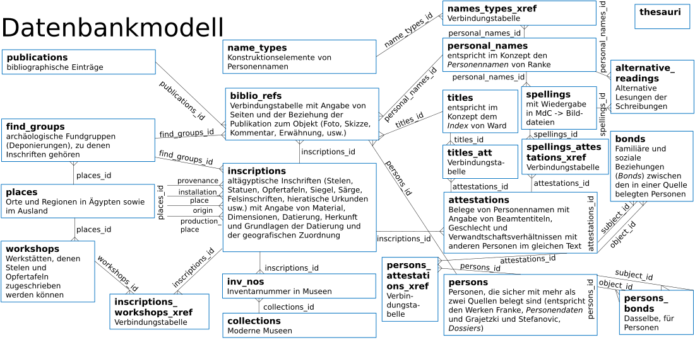

# Persons and Names of the Middle Kingdom  
# Database structure
The data is stored in a MySQL database. For the sake of compatibility with other relational database management systems only the following datatypes are used:  
* `CHAR` (standard SQL data type `NATIONAL CHARACTER`) for short attributes;  
* `VARCHAR(255)` (standard SQL data type `NATIONAL CHARACTER VARYING (255)`) for short text values;  
* `VARCHAR(4000)` (standard SQL data type `NATIONAL CHARACTER VARYING (4000)`) for longer text values (length restricted for compatibility with MS SQL Server);  
* `INT` (standard SQL data type `INTEGER`) for IDs;    
* `DATE` (standard SQL data type `DATE`) for dates.  
The collation `utf8mb4_unicode_ci` is used for all `CHAR` and `VARCHAR` fields.

## The ID numbers
The database uses a system of ID numbers that ensures that each ID uniquely identifies an entity within the whole database and thus contains information on the table where the record is stored.
The IDs are stored as signed 32-bit integers, which are used as bit fields, whereby the table is coded in bits 4 to 9, and bits 10 to 32 are used for the number of the record in the table, allowing for 8388607
 records per table. Bits 1 to 3 are reserved. The table ID can be extracted from the record ID with two simple arithmetic operations    `$table_id = (($id & 0x1F800000) / 0x800000);` in PHP 5 or in JavaScript.

## Tables

### thesauri (table_id: 2)  
This is a supporting table containing keys and values of own and third-party thesauri used in the database.  

| Field name | Type | Description |
| --- | :---: | :--- |
| thesauri_id | INT | Unique record ID, primary key |
| thesaurus   | INT | The handle of the thesaurus to which this record belongs. Under thesaurus=0 all thesauri represented in this table are listed.  |
| parent      | INT | The `thesauri_id` of the superordinate thesaurus entry |
| sort_value  | INT | The value used for sorting thesaurus entries  |
| item_name  | VARCHAR(255) | The textual value of the thesaurus entry |
| external_key| VARCHAR(255) | The key of the corresponding thesaurus entry in a standard external thesaurus (such as the [THOT](http://thot.philo.ulg.ac.be/index.html) project)  |

<!--- | key_number  | INT | The numeric key of the thesaurus entry | --->

### publications (table_id: 2)  
Each record in this table describes a printed or online publication (a bibliographic entry). Here goes everything published that can be cited using the author-year system.   
*Equivalent: <http://www.cidoc-crm.org/cidoc-crm/E31_document>*  

| Field name | Type | Description |
| --- | :---: | :--- |
| publications_id | INT | Unique record ID, primary key |
| csl_json | TEXT | Bibliographical data in the [CSL-JSON](https://github.com/citation-style-language/schema/blob/master/csl-data.json) format |
| author_year | VARCHAR(255) | The author-year handle for referring |
| html_entry | VARCHAR(4000) | Precomposed bibliographical entry in the Chicago Manual of Art Style format (HTML) |
| oeb_id | VARCHAR(4000) | The ID of the corresponding record in the [Online Egyptological Bibliography](http://oeb.griffith.ox.ac.uk/) (not available for all records) |

*Note:* On the back end, CLS-JSON bibliographical descriptions are converted into HTML bibliographical entries using [citeproc-node](https://github.com/zotero/citeproc-node).

### biblio_refs (table_id: 7)  
Each record in this table describes a reference from a publication (if the `source_id` field is not empty)
or a webpage (if the `source_url` field is not empty) to an entity (an inscribed object, a person's dossier, 
a workshop, an archaeological assemblage, a personal name, or a title.   
*Equivalent: <http://www.cidoc-crm.org/cidoc-crm/P70i_is_documented_in> statements*  

| Field name     | Type | Description |
| ---            | :---: | :--- |
| biblio_refs_id | INT | Unique record ID, primary key |
| reference_type | CHAR(20) | The type of the reference |
| source_id      | INT | The ID of the referring publication in the table `publications` |
| source_url     | VARCHAR(4000) | URL for online sources that cannot be cited using the author-year system |
| source_title   | VARCHAR(4000) | Reference to an offline source that cannot be cited using the author-year system (an archival document, and offline museum database, etc.; this also includes the references to the Topographical Bibliography to keep references to published and unpublished TopBib entries in one place) or the title of the online source referred to in `source_url` |
| accessed_on    | DATE | The date when the online or offline source that cannot be cited using the author-year system was accessed |
| object_id      | INT | The ID of the referred entity |
| pages          | VARCHAR(255) | Pages |
| note           | VARCHAR(4000) | Note related to the reference (for example, mistakes in the publication) |

### inscriptions (table_id: 7)  
Each record in this table represents a physical object with an Egyptian inscription. This can be an object now located in a museum or a private collection or known from a publication, archival material, or a sale catalogue (such as a stela, statue, offering table, coffin, seal, papyrus, etc.), a rock inscription, an inscribed tomb, or another structure. Objects coming from the same structure of a different type than the objects themselves (e. g., stelae originally installed in the same offering chapel) are considered different objects, but objects that are parts of an originally integral object of the same type, now decomposed, (e. g. two parts of the same statue, now stored in different museums) are considered the same object. 

| Field name        | Type  | Description |
| ---               | :---: | :---        |
| inscriptions_id   | INT | Unique record ID, primary key |
| title  | VARCHAR(255) | The title under which the object is referred to in the database (the most relevant pair of the museum name and inventory number for objects or the reference to the most relevant (usually first) publication)  |
| object_type  | VARCHAR(255) | The `item_name` of the inscription type in the object_type thesaurus (thesaurus 1) *example: stela*  |
| object_subtype | VARCHAR(255) | The `item_name` of the inscription type in the object_subtype thesaurus (thesaurus 2) *example: block-statue *  |
| material          | VARCHAR(255) | The `item_name` of the material type in the material  thesaurus (thesaurus 3) *based on a subset of the [THOT Material thesaurus](http://thot.philo.ulg.ac.be/concept/thot-6200)* |
| assemblages_id    | INT | The ID of the archaeological assemblage to which the inscribed object belongs in the table `assemblages` |
| text_content      | VARCHAR(255) | The `item_name` of the inscription type in the text_content thesaurus (thesaurus 2) *based on a subset of the [THOT Text content thesaurus](http://thot.philo.ulg.ac.be/concept/thot-18634)* |
| script            | VARCHAR(255) | The `item_name` of the inscription type in the script thesaurus (thesaurus 4) *based on a subset of the [THOT Ancient Egyptian scripts thesaurus](http://thot.philo.ulg.ac.be/concept/thot-111)* |
| provenance        | VARCHAR(255) | The `place_name` of the record in the table `places` corresponding to the place where the object was found or purchased |
| provenance_note   | VARCHAR(4000) | Note related to the `provenance` |
| installation_place| VARCHAR(255) | The `place_name` of the record in the table `places` corresponding to the place where the object should have been installed (when different from the provenance or when the provenance is unknown or unreliable, as in case of purchases) |
| installation_place_note   | VARCHAR(4000) | Note related to the `installation_place` |
| origin            | VARCHAR(255) | The `place_name` of the record in the table `places` corresponding to the place where the person(s) named in the inscription should have lived |
| origin_note       | VARCHAR(4000) | The reasoning behind the `origin` with relevant bibliographical references whenever possible |
| production_place  | VARCHAR(255) | The `place_name` of the record in the table `places` corresponding to the place where the object should have been produced |
| production_place_note | VARCHAR(4000) | The reasoning behind the `production_place` with relevant bibliographical references whenever possible |
| dating            | VARCHAR(255) | The `item_name` of the period to which the object can be dated in the dating thesaurus (thesaurus 5) *loosely based on a subset of the [THOT Dates and dating systems thesaurus](http://thot.philo.ulg.ac.be/concept/thot-114)* |
| dating_note       | VARCHAR(4000) | The reasoning behind the `dating`  |
| last_king_id      | VARCHAR(255) | The `id`  of the most recent king explicitly named on the object in the king thesaurus (thesaurus 6) *loosely based on a subset of the [THOT Dates and dating systems thesaurus](http://thot.philo.ulg.ac.be/concept/thot-114)* |
| note              | VARCHAR(4000) | General notes related to the object |

### assemblages (table_id: 23)  
Each record in this table represents an archaeological assemblage (such as a burial or a memorial chapel) where one or more inscribed objects were found. This data is supplementary and is entered only to the extent that it can be relevant for dating and grouping together inscribed objects.  

| Field name        | Type  | Description |
| ---               | :---: | :---        |
| assemblages_id    | INT   | Unique record ID, primary key |
| site              | VARCHAR(255) | The `place_name` of the record in the table `places` corresponding to the place where the assemblage is located |
| site_area         | VARCHAR(255) | The part of the site where the assemblage is located |
| exact_location    | VARCHAR(4000)| A detailed description of the assemblage location |
| title             | VARCHAR(255) | The title under which the assemblage is referred to in the database |
| assemblage_type   | VARCHAR(255) | The `item_name` of the assemblage type in the assemblage_type thesaurus (thesaurus 7)  |
| architecture      | VARCHAR(4000)| Relevant information on the substructure and the superstructure |
| human_remains     | VARCHAR(4000)| Relevant information on the deceased in the assemblage |
| finds             | VARCHAR(4000)| Relevant information on the finds other than inscribed objects |
| disturbance       | VARCHAR(255) | The `item_name` of the assemblage type in the disturbance thesaurus (thesaurus 8)  |
| dating            | VARCHAR(255) | The `item_name` of the period to which the assemblage can be dated in the dating thesaurus (thesaurus 5) *loosely based on a subset of the [THOT Dates and dating systems thesaurus](http://thot.philo.ulg.ac.be/concept/thot-114)* |
| dating_note       | VARCHAR(4000) | The reasoning behind the `dating`  |
| note              | VARCHAR(4000) | General notes related to the assemblage |

### workshops (table_id: 20)  
Each record in this table represents a workshop producing inscribed objects that was discussed in scholarly literature. In other words, it represents a group of objects set off by several artistic and/or palaeographic peculiarities, which allow surmising that the objects come from the same timeframe and were produced at the same place.  

| Field name        | Type  | Description |
| ---               | :---: | :---        |
| workshops_id      | INT   | Unique record ID, primary key |
| title             | VARCHAR(255) | The title under which the workshop is referred to in the database |
| production_place  | VARCHAR(255) | The `place_name` of the record in the table `places` corresponding to the place where the objects should have been produced |
| production_place_note | VARCHAR(4000) | The reasoning behind the `production_place` with relevant bibliographical references whenever possible |
| dating            | VARCHAR(255) | The `item_name` of the period to which the workshop can be dated in the dating thesaurus (thesaurus 5) *loosely based on a subset of the [THOT Dates and dating systems thesaurus](http://thot.philo.ulg.ac.be/concept/thot-114)* |
| dating_note       | VARCHAR(4000) | The reasoning behind the `dating`  |
| note              | VARCHAR(4000) | General notes related to the assemblage |

### inscriptions_workshops_xref (table_id: 21)  
An associative table for linking workshops to inscriptions (assuming that contradictory opinions can be expressed in scholarly literature). 

| Field name        | Type  | Description |
| ---               | :---: | :---        |
| inscriptions_workshops_xref_id | INT   | Unique record ID, primary key |
| workshops_id                   | INT   | ID of the workshop |
| inscriptions_id                | INT   | ID of the workshop |

### places (table_id: 22)  
Each record in this table represents the name of a place or a region associated with inscriptions catalogues in this database. One location can be listed in this table several times under different names (modern and ancient).

| Field name        | Type  | Description |
| ---               | :---: | :---        |
| places_id         | INT   | Unique record ID, primary key |
| place_name        | VARCHAR(255) | The form of the name used in this database |
| relative_location | VARCHAR(255) | The `item_name` in the relative_location thesaurus (thesaurus 9), either "Eastern Desert", "Nile Valley", "Western Desert", or the "Levant" |
| latitude          | INT   | The latitude of the place (or of the central point of the region) in decimal degrees north of equator multiplied by 100. Thus 2572 stands for 25.72 N and 25° 43' N. This value is used for sorting the places in a north to south or south to north order.  |
| topbib_id         | VARCHAR(255) | The ID of the place name in the [Digital TopBib](http://topbib.griffith.ox.ac.uk) database, examples: [501-180](http://topbib.griffith.ox.ac.uk//dtb.html?topbib=501-180) and [901-210-003](http://topbib.griffith.ox.ac.uk//dtb.html?topbib=901-210-003) |
| tm_geoid          | INT   | The ID of the place in the Trismegistos Geo database, example: [188](http://www.trismegistos.org/place/188) |
| artefacts_url     | VARCHAR(255) | The URL of the site page in the [Artefacts of Excavation](http://egyptartefacts.griffith.ox.ac.uk) database, example: <http://egyptartefacts.griffith.ox.ac.uk/node/1149> |

### inv_nos (table_id: 25)  
Each record in this table represents an inventory number of an inscribed object in a museum.  
*Equivalent: <http://www.cidoc-crm.org/cidoc-crm/P1_is_identified_by> statement and <http://www.cidoc-crm.org/cidoc-crm/E42_Identifier> entity*   

| Field name        | Type  | Description |
| ---               | :---: | :---        |
| inv_nos_id        | INT   | Unique record ID, primary key |
| inscriptions_id   | INT   | ID of the inscribed object identified by the inventory number |
| collections_id    | INT   | ID of the museum |
| inv_no            | VARCHAR(255) | Inventory number; *equivalent: <http://www.w3.org/2000/01/rdf-schema#label>* |
| status            | CHAR(11) | Status of the inventory number ("main", "alternative", "obsolete", or "erroneous") |
| note              | VARCHAR(4000)| General notes related to the inventory number |

### collections (table_id: 26)  
Each record in this table represents a collection containing inscribed objects identified by inventory numbers.  
  

| Field name        | Type  | Description |
| ---               | :---: | :---        |
| collections_id    | INT   | Unique record ID, primary key |
| full_name         | VARCHAR(4000) | Official full name of the collection |
| title             | VARCHAR(255) | Short title used in the database |
| location          | VARCHAR(255) | Locality and country |
| url               | VARCHAR(4000)| Official website of the collection (main page) |
| online_collection | VARCHAR(4000)| URL of the online collection |
| tm_coll_id        | INT    | [Trismegistos Collections](http://www.trismegistos.org/coll/index.php) ID  |
| thot_url        | VARCHAR(4000)    | URI of the collection in the [THOT Museums and private collections thesaurus](http://thot.philo.ulg.ac.be/concept/thot-6197) |
| artefacts_url | VARCHAR(4000)| URL of the collection page in the [Artefacts of Excavation](http://egyptartefacts.griffith.ox.ac.uk) database |

  
### attestations (table_id: 8)  
Each record in this table represents an attestation of a person, of one or two personal names, and of a string of titles (if any) born by that person in an inscription.  

| Field name        | Type  | Description |
| ---               | :---: | :---        |
| attestations_id   | INT   | Unique record ID, primary key |
| inscriptions_id   | INT   | ID of the inscription |
| sex               | CHAR(1)        | Sex of the attested person ("m", "f", "?" *sex unknown*, or "a" *for animals*)|
| title_string      | VARCHAR(4000)| Transliterated title string in lowercase Unicode as preserved in the inscription, separated by semicolons |
| personal_name     | VARCHAR(255)   | Transliterated personal name or combination of names in lowercase Unicode as preserved in the inscription, double names separated by / |
| spellings_id1     | INT   | ID of the corresponding personal name spelling (the first or the only name) |
| spellings_id2     | INT   | ID of the corresponding personal name spelling (the second name) |
| status            | CHAR(5)        | Status of the person on the monument ("owner" or "")|
| location          | VARCHAR(255)        | The place in the inscription where the person is mentioned (register, line number, according to the standard publication or other relevant indications)|
| note              | VARCHAR(4000)| General notes related to the attestation |

### persons_att (table_id: 1)  
Each record in this table represents an statement on the appurtenance of an attestation to a dossier.  

| Field name        | Type  | Description |
| ---               | :---: | :---        |
| persons_att_id    | INT   | Unique record ID, primary key |
| attestations_id   | INT   | ID of the attestation  |
| persons_id        | INT   | ID of the dossier  |
| reasoning         | VARCHAR(255)   | List of `item_name` values in the dossier_reasoning thesaurus separated by semicolons |
| status            | CHAR(14)   | Status of the statement ("accepted", "weak", or "counterfactual")  |
| note              | VARCHAR(4000)| General notes related to the statement |

### persons (table_id: 27)  
Each record in this table represents a dossier of a person attested in more than one inscription.  
*Equivalent: entries in* D. Franke, *Personendaten aus dem Mittleren Reich (20.-16. Jahrhundert v. Chr.)*

| Field name        | Type  | Description |
| ---               | :---: | :---        |
| persons_id        | INT   | Unique record ID, primary key |
| sex               | CHAR(1)        | Sex of the person ("m", "f", "?" *sex unknown*, or "a" *for animals*)|
| title             | VARCHAR(255)   | The designation of the dossier referred to in the database such as the reference to the work where the dossier was first established |
| title_string      | VARCHAR(4000)| Transliterated title string in lowercase Unicode as reconstructed from all available attestations, separated by semicolons |
| personal_name     | VARCHAR(255)   | Transliterated personal name or combination of names in lowercase Unicode as reconstructed from all available attestations, double names separated by / |
| note              | VARCHAR(4000)| General notes related to the person |

### titles_att (table_id: 28)  
Each record in this table represents an attestation of a title in a string of titles in an inscription.  

| Field name        | Type  | Description |
| ---               | :---: | :---        |
|titles_att_id      | INT   | Unique record ID, primary key |
|titles_id          | INT   | ID of the attested title |
|attestations_id    | INT   | ID of the attestation of a person bearing a title |
|sequence_number    | INT   | Sequence number of the title in the title string |
|spelling    | VARCHAR(255)   | Optional: the spelling of the title in JSESH-compatible MdC codes |

### titles (table_id: 5)  
Each record in this table represents an Egyptian title.  
*Equivalent: entries in* W. A. Ward, *Index of Egyptian Administrative and Religious Titles of the Middle Kingdom*

| Field name        | Type  | Description |
| ---               | :---: | :---        |
|      titles_id    | INT   | Unique record ID, primary key |
| title             | VARCHAR(255)   | Transliterated title in lowercase unicode |
| translation_en    | VARCHAR(255)   | English translation of the title |
| translation_de    | VARCHAR(255)   | German translation of the title |
| tla | VARCHAR(255)   | List of corresponding lemma numbers in the [Thesaurus Linguae Aegyptiae](http://aaew.bbaw.de/tla/servlet/TlaLogin), separated by semicolons |
| hannig | VARCHAR(255)   | List of corresponding lemma numbers in R. Hannig, *Ägyptisches Wörterbuch II: Mittleres Reich und Zweite Zwischenzeit*, separated by semicolons |
| note              | VARCHAR(4000)| General notes related to the title |

*Note:* The numbers of the title in W. A. Ward, *Index of Egyptian Administrative and Religious Titles* and H. G. Fischer, *Supplement* are entered using `biblio_refs`

### spellings (table_id: 29)  
Each record in this table represents a spelling type of a personal name. Generic entries are generated for names attested in sources accessible only in transliteration or translation.   

| Field name        | Type  | Description |
| ---               | :---: | :---        |
| spellings_id      | INT   | Unique record ID, primary key |
| personal_names_id | INT   | ID of the personal name |
| spelling          | VARCHAR(255)   | The spelling of the name in in JSESH-compatible MdC codes |
  

### personal_names (table_id: 17)  
Each record in this table represents an Egyptian title.  
*Equivalent: entries in* H. Ranke, *Die ägyptischen Personennamen*

| Field name        | Type  | Description |
| ---               | :---: | :---        |
|personal_names_id  | INT   | Unique record ID, primary key |
|personal_name      | VARCHAR(255)   | Transliterated personal name in lowercase Unicode |
|translation_en     | VARCHAR(255)   | English translation of the name |
|translation_de     | VARCHAR(255)   | German translation of the name |
|sex                | CHAR(4)        | Sex of persons bearing the name ("m", "f", or "both")|
|ranke              | VARCHAR(255)   | List of corresponding entries in Ranke, *Personennamen*, separated by semicolons |
|tla                | VARCHAR(255)   | List of corresponding lemma numbers in the [Thesaurus Linguae Aegyptiae](http://aaew.bbaw.de/tla/servlet/TlaLogin), separated by semicolons |
|scheele-schweitzer | VARCHAR(255)   | List of corresponding entries in K. Scheele-Schweitzer, *Die Personennamen des Alten Reiches*, separated by semicolons |
|agea               | VARCHAR(255)   | List of corresponding name numbers in the [AGÉA database](http://www.ifao.egnet.net/bases/agea/), separated by semicolons |

### name_types (table_id: 30)  
Each record in this table represents a type or a  pattern in Egyptian personal names.  

| Field name        | Type  | Description |
| ---               | :---: | :---        |
|name_types_id      | INT   | Unique record ID, primary key |
|parent_id          | INT   | ID of the parent name type |
|title              | VARCHAR(255)   | Transliterated personal name pattern in lowercase Unicode or the title of a name type |
| note              | VARCHAR(4000)| General notes related to the name type |

### names_types_xref (table_id: 31)  
Each record in this table represents a correspondence between a personal name and a name pattern.  

| Field name        | Type  | Description |
| ---               | :---: | :---        |
|names_types_xref_id| INT   | Unique record ID, primary key |
|personal_names_id  | INT   | ID of the personal name |
|name_types_id      | INT   | ID of the name type |

### bonds (table_id: 24)  
Each record represents a statement about a bond between two persons stated in inscriptions or representations (as in cases when the bond of matrimony between the two persons persons is implied only by iconography) on an inscribed object.  
*Equivalent: [SNAP:DRGN](http://snapdrgn.net/ontology)/Bond*

| Field name        | Type  | Description |
| ---               | :---: | :---        |
|       bonds_id    | INT   | Unique record ID, primary key |
|     subject_id    | INT   | `attestations_id` of the record in `attestations` corresponding to the subject of the statement (the person whose name stands in apposition to the phrase expressing the bond or the antecedent of the relative form) |
| predicate         | VARCHAR(255) | The `item_name` of the bond type in the bond thesaurus (thesaurus #) * based on a subset of the elements of [SNAP:DRGN Bond class](http://snapdrgn.net/ontology); example: SonOf* |
| wording           | VARCHAR(255) | Transliterated exact expression of the bond in lowercase Unicode as attested in the inscription. *Example: sꜣ⸗f* |
|      object_id    | INT   | `attestations_id` of the record in `attestations` corresponding to the object of the statement (usually the person referred to by the suffix pronoun or introduced as the agent of a relative form ) |

### persons_bonds (table_id: 32)  
Each record represents a statement about a bond between two personal dossiers reconstructed from more than one source.  
*Equivalent: [SNAP:DRGN](http://snapdrgn.net/ontology)/Bond*

| Field name        | Type  | Description |
| ---               | :---: | :---        |
|persons_bonds_id    | INT   | Unique record ID, primary key |
|     subject_id    | INT   | `persons_id` of the record in `persons` corresponding to the subject of the statement   |
| predicate         | VARCHAR(255) | The `item_name` of the bond type in the bond thesaurus (thesaurus #) * based on a subset of the elements of [SNAP:DRGN Bond class](http://snapdrgn.net/ontology); example: SonOf* |
|      object_id    | INT   | `persons_id` of the record in `persons` corresponding to the object of the statement  |

**Disclaimer: This is a work in progress. The database structure is subject to change before the database itself is published.**  
